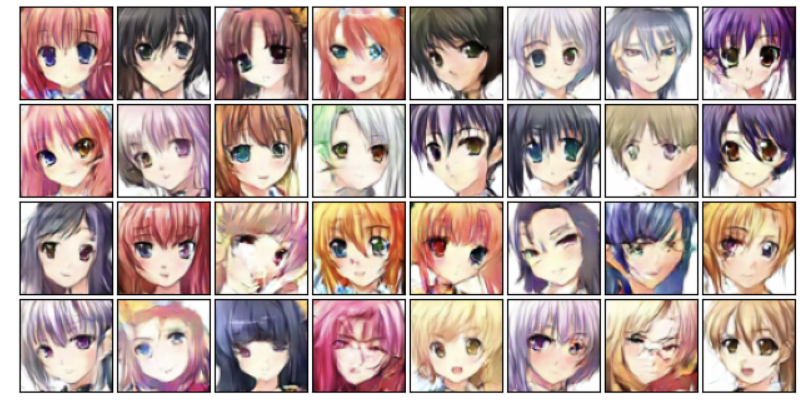

# Anime Face Generation with DCGAN

基于 **DCGAN（Deep Convolutional GAN）** 的动漫人物头像生成项目。使用 Kaggle 动漫人脸数据集训练生成器与判别器，能够从 100 维随机噪声直接生成全新的 **64×64** 动漫风格头像。

## 效果预览



模型收敛后可生成具有明显动漫风格的头像：统一的线条与配色、对称的五官结构、多种发色/发型与背景色调。训练过程中的每个 epoch 都会抽样生成 4 张图片用于观察效果，最终用 32 张噪声一次性生成 4×8 的样例网格（见 `EVAL.ipynb` 输出）。

## 数据集

- 来源：Kaggle 动漫人脸数据集（`anime_faces`）
- 规模：**63,565** 张图片
- 预处理：
  - `Resize((64, 64))` 统一分辨率
  - `ToTensor()`
  - `Normalize([0.5, 0.5, 0.5], [0.5, 0.5, 0.5])`，将像素映射到 `[-1, 1]`，与生成器末层的 `Tanh` 对应

## 网络结构

### 生成器 Generator

输入 `100 × 1 × 1` 的噪声向量，经 5 层转置卷积逐级上采样为 `3 × 64 × 64` 图像：

| 层 | 结构 | 输出尺寸 |
|---|---|---|
| 1 | `ConvTranspose2d(100→512, k=4, s=1, p=0)` + BN + ReLU | 512×4×4 |
| 2 | `ConvTranspose2d(512→256, k=4, s=2, p=1)` + BN + ReLU | 256×8×8 |
| 3 | `ConvTranspose2d(256→128, k=4, s=2, p=1)` + BN + ReLU | 128×16×16 |
| 4 | `ConvTranspose2d(128→64, k=4, s=2, p=1)` + BN + ReLU | 64×32×32 |
| 5 | `ConvTranspose2d(64→3, k=4, s=2, p=1)` + Tanh | 3×64×64 |

### 判别器 Discriminator

输入 `3 × 64 × 64` 图像，经 4 层步长卷积下采样后输出单个真伪概率：

| 层 | 结构 | 输出尺寸 |
|---|---|---|
| 1 | `Conv2d(3→64, k=4, s=2, p=1)` + ReLU | 64×32×32 |
| 2 | `Conv2d(64→128, k=4, s=2, p=1)` + ReLU | 128×16×16 |
| 3 | `Conv2d(128→256, k=4, s=2, p=1)` + ReLU | 256×8×8 |
| 4 | `Conv2d(256→512, k=4, s=2, p=1)` + ReLU | 512×4×4 |
| 5 | `Conv2d(512→1, k=4, s=1, p=0)` + Sigmoid + Flatten | 1 |

> 说明：生成器与判别器的**每一层卷积都加了谱归一化（Spectral Normalization）**，用于约束判别器的 Lipschitz 常数、稳定 GAN 训练；判别器未使用 BatchNorm，以保留每个样本的真伪信息。

## 训练配置

| 配置项 | 取值 |
|---|---|
| Batch Size | 128 |
| Epochs | 50 |
| 损失函数 | `BCELoss` |
| 优化器 | `Adam(lr=0.002, betas=(0.5, 0.999))`（G / D 各自独立） |
| 标签平滑 | 真实样本标签取 **0.95**（而非 1.0），生成样本标签取 0 |
| 设备 | CUDA（自动回退 CPU） |

训练流程为标准的 GAN 交替更新：

1. **更新 D**：`(fake_loss + true_loss) / 2`，其中假样本来自 `G(noise).detach()`，避免梯度回传到 G；
2. **更新 G**：以 `D(G(noise))` 被判别为真实（标签 0.95）为目标做反向传播；
3. 每个 epoch 结束后记录 G/D 平均损失，并抽样 4 张图片可视化，同时绘制双损失曲线。

## 项目结构

```
animation_gan/
├── MAIN.ipynb      # 训练脚本：数据加载、模型定义、训练循环、导出 TorchScript 模型
├── EVAL.ipynb      # 推理脚本：加载导出的模型，批量生成 32 张头像并网格展示
├── README.md       # 项目说明
├── model/
│   └── anime_gan.pt    # 已训练好的生成器（TorchScript，约 14.4 MB）
├── sample/
│   └── sample.png      # 生成效果样例（4×8 网格）
└── image/              # 数据集图片（63,565 张，体积较大，未上传至仓库）
    └── anime_faces/
```

## 使用方法

### 环境依赖

```
torch
torchvision
numpy
matplotlib
```

### 训练

打开 `MAIN.ipynb` 依次运行即可。注意把数据集路径改成你自己的路径：

```python
dataset = ImageFolder(root=r'.../animation_gan/image', transform=transform)
```

训练结束后生成器通过 `torch.jit.trace` 固化并保存为 `model/anime_gan.pt`。

### 推理 / 生成新头像

`EVAL.ipynb` 中只需加载模型并送入随机噪声：

```python
import torch
import matplotlib.pyplot as plt

device = 'cuda' if torch.cuda.is_available() else 'cpu'

# 加载已训练好的生成器（TorchScript，无需模型定义代码）
G = torch.jit.load('model/anime_gan.pt', map_location=device)
G.eval()

noise = torch.randn(32, 100, 1, 1, device=device)
with torch.no_grad():
    fake_samples = G(noise).cpu()

# 反归一化到 [0, 1] 后展示
plt.figure(figsize=(8, 4))
for i in range(32):
    plt.subplot(4, 8, i + 1)
    img = (fake_samples[i] / 2 + 0.5).permute(1, 2, 0)
    plt.imshow(img)
    plt.xticks([]); plt.yticks([])
plt.subplots_adjust(wspace=0.05, hspace=0.05)
plt.show()
```

每次更换随机噪声即可得到不同的新头像，无需重新训练。

## 说明与局限

- 生成分辨率为 **64×64**，细节相对有限，适合作为风格探索与 GAN 入门实践。
- GAN 训练对超参数较敏感，不同随机种子下效果会有波动。
- 数据集图片来源于 Kaggle，仅用于学习研究，版权归原作者所有。
